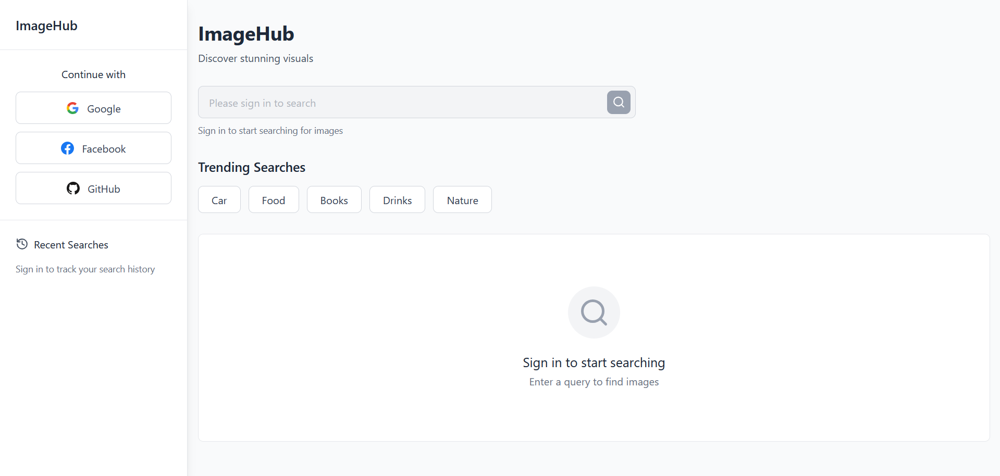
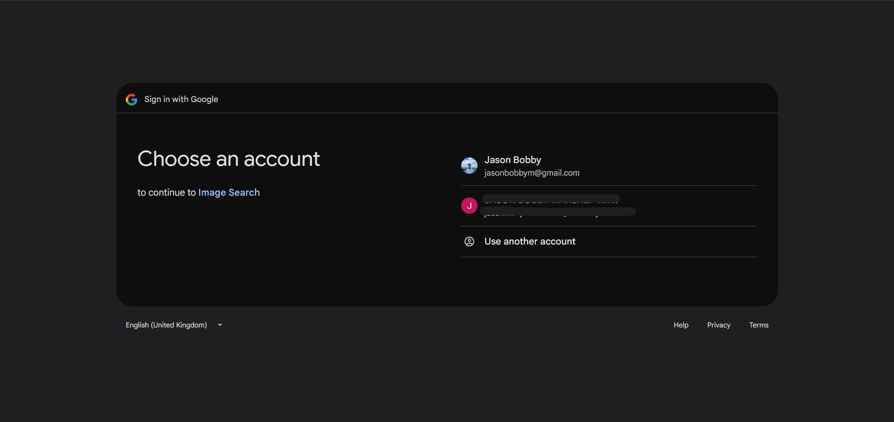
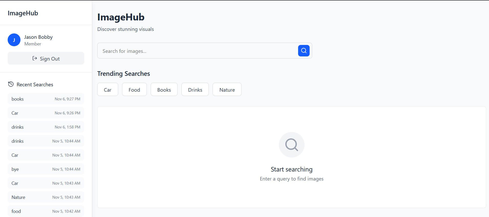
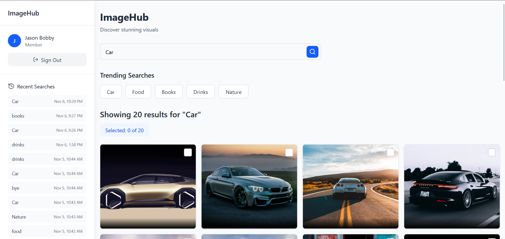
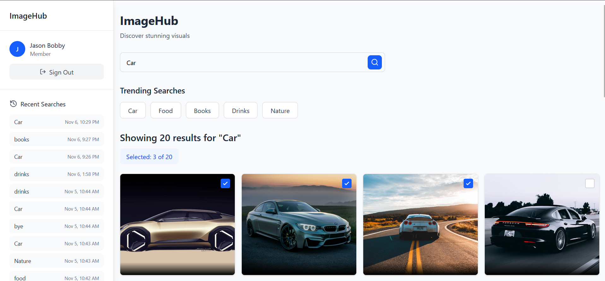
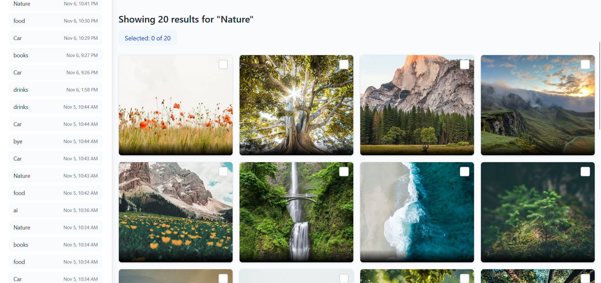

# Image Hub

A full-stack image search application built with the MERN stack (MongoDB, Express.js, React, Node.js) and integrated with the Unsplash API. Features user authentication and search history tracking.

## Prerequisites

Before you begin, ensure you have the following installed:
- [Node.js](https://nodejs.org/) (v14 or higher)
- [MongoDB](https://www.mongodb.com/try/download/community) (v4.4 or higher)
- [npm](https://www.npmjs.com/)

## Project Structure

```
project-root/
├── client/                      # React frontend
│   ├── node_modules/           # Frontend dependencies
│   ├── public/                 # Static files
│   ├── src/                    # Source files
│   │   ├── assets/            # Images, fonts, static assets
│   │   ├── components/        # Reusable React components
│   │   │   ├── EmptyState.jsx        # Empty state placeholder
│   │   │   ├── ImageCard.jsx         # Image display card
│   │   │   ├── ImageGrid.jsx         # Grid layout for images
│   │   │   ├── LoadingSkeleton.jsx   # Loading placeholder
│   │   │   ├── LoginButtons.jsx      # Authentication buttons
│   │   │   ├── SearchBar.jsx         # Search input component
│   │   │   ├── SearchResults.jsx     # Search results display
│   │   │   ├── Sidebar.jsx           # Navigation sidebar
│   │   │   └── TrendingSearches.jsx  # Trending topics display
│   │   ├── lib/               # Utility functions and helpers
│   │   │   └── axios.js       # Axios configuration
│   │   ├── pages/             # Page components
│   │   │   └── ImageSearchApp.jsx    # Main search page
│   │   ├── App.jsx            # Main App component
│   │   ├── index.css          # Global styles
│   │   └── main.jsx           # Application entry point
│   ├── .gitignore             # Git ignore rules
│   ├── eslint.config.js       # ESLint configuration
│   ├── index.html             # HTML template
│   ├── package.json           # Frontend dependencies
│   ├── package-lock.json      # Locked versions
│   ├── README.md              # Frontend documentation
│   └── vite.config.js         # Vite configuration
│
├── server/                     # Express backend
│   ├── config/                # Configuration files
│   │   └── passport.js        # Passport.js authentication config
│   ├── lib/                   # Utility functions
│   │   └── db.js              # Database connection setup
│   ├── middleware/            # Custom middleware
│   │   └── auth.js            # Authentication middleware
│   ├── models/                # Mongoose schemas
│   │   ├── SearchHistory.js   # Search history model
│   │   └── User.js            # User model
│   ├── node_modules/          # Backend dependencies
│   ├── routes/                # API routes
│   │   ├── authRoutes.js      # Authentication endpoints
│   │   └── unsplashRoutes.js  # Unsplash API endpoints
│   ├── .env                   # Environment variables
│   ├── .gitignore             # Git ignore rules
│   ├── package.json           # Backend dependencies
│   ├── package-lock.json      # Locked versions
│   └── server.js              # Server entry point
│
└── README.md                   # Project documentation
```

## Backend Structure Explanation

- config/: Configuration files for third-party services (Passport.js for authentication)
- lib/: Utility modules and database connection logic
- middleware/: Custom Express middleware for authentication, validation, etc.
- models/: MongoDB/Mongoose schema definitions for data models
- routes/: API endpoint definitions organized by feature
- server.js: Main entry point that starts the Express server

## Frontend Structure Explanation

- src/components/: Reusable UI components that can be used across different pages
- src/pages/: Main page components that represent different routes/views
- src/lib/: Utility functions, API configurations, and helper modules
- src/assets/: Static resources like images, fonts, and icons
- public/: Publicly accessible static files served directly

## Installation

### 1. Clone the Repository

```bash
git clone https://github.com/jas212-on/image-search.git
cd image-search
```

### 2. Backend Setup

Navigate to the server directory and install dependencies:

```bash
cd server
npm install
```

Install additional packages (if not already in package.json):

```bash
npm install axios express dotenv cors express-session passport mongoose
```

Create a `.env` file in the server directory:

```env
PORT=5000

MONGODB_URI=your-mongodb-uri

GOOGLE_CLIENT_ID=your-google-client
GOOGLE_CLIENT_SECRET=your-google-client-secret

GITHUB_CLIENT_ID=your-github-client-id
GITHUB_CLIENT_SECRET=your-github-client-secret

UNSPLASH_ACCESS_KEY=your-unsplash-access-key
```

### 3. Frontend Setup

Navigate to the client directory and install dependencies:

```bash
cd ../client
npm install
```
Install additional packages (if not already in package.json):

```bash
npm install axios lucide-react react-router-dom tailwindcss @tailwindcss/vite
```

## Running the Application

### Run Frontend and Backend Separately

**Terminal 1 - Start Backend:**
```bash
cd server
npm start
# or for development with nodemon
npm run dev
```

**Terminal 2 - Start Frontend:**
```bash
cd client
npm run dev
```

The application will open at `http://localhost:5173`


2. The application will automatically connect to MongoDB using the URI in your `.env` file

### MongoDB Atlas (Cloud)

1. Create a free account at [MongoDB Atlas](https://www.mongodb.com/cloud/atlas)
2. Create a new cluster
3. Get your connection string
4. Update `MONGODB_URI` in your `.env` file:

## Available Scripts

### Backend (server/)
- `npm start` - Start the server
- `npm run dev` - Start with nodemon (auto-restart)
- `npm test` - Run tests

### Frontend (client/)
- `npm start` - Start development server
- `npm run build` - Create production build
- `npm test` - Run tests
- `npm run eject` - Eject from Create React App


## Technologies Used

- **Frontend:** React, React Router, Axios
- **Backend:** Node.js, Express.js
- **Database:** MongoDB, Mongoose
- **Authentication:** Passport.js
- **Styling:** Tailwind


## cURL Examples

## 1. Check Login Status

- Endpoint: GET /login/success
- Requires session cookie from a logged-in user

```bash
curl -X GET "http://localhost:5000/api/login/success" \
--cookie "connect.sid=<YOUR_SESSION_COOKIE>"
```

## 2. Logout

- Endpoint: GET /logout
- Requires session cookie

```bash
curl -X GET "http://localhost:5000/api/logout" \
--cookie "connect.sid=<YOUR_SESSION_COOKIE>"
```

## 3. OAuth Routes (Google, Facebook, GitHub)

- These cannot be fully tested via cURL because OAuth redirects to a browser for login.

- **Google Login:** `GET /google` → Redirects user to Google login page
- **Google Callback:** `GET /google/callback` → Handles Google OAuth callback
- **Facebook Login:** `GET /facebook` → Redirects user to Facebook login page
- **Facebook Callback:** `GET /facebook/callback` → Handles Facebook OAuth callback
- **GitHub Login:** `GET /github` → Redirects user to GitHub login page
- **GitHub Callback:** `GET /github/callback` → Handles GitHub OAuth callback

## 4. Search Images (GET /search?q=<query>)

```bash
curl -X GET "http://localhost:5000/api/search?q=nature" \
--cookie "connect.sid=<YOUR_SESSION_COOKIE>"
```

## 5. Get User Search History (GET /history)

```bash
curl -X GET "http://localhost:5000/api/history" \
--cookie "connect.sid=<YOUR_SESSION_COOKIE>"
```

## 6. Get Top Searches (GET /top-searches)

```bash
curl -X GET "http://localhost:5000/api/top-searches"
```


## Screenshots









